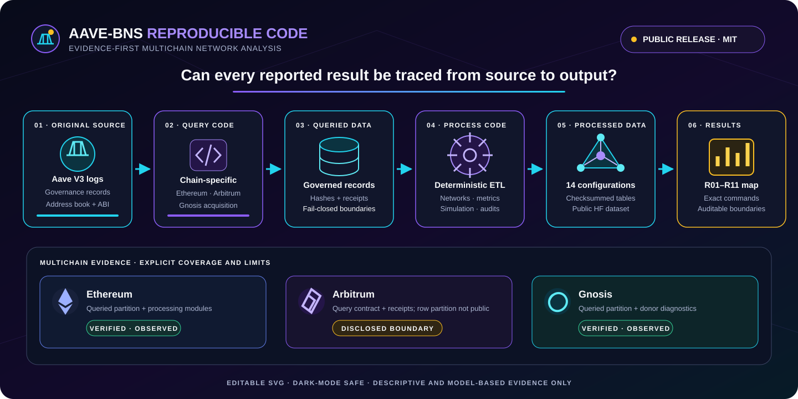

<div align="center">

# Aave-BNS Reproducible Analysis Code

**Evidence-first multichain network analysis for decentralized finance**

<a href="https://huggingface.co/datasets/zlysunshine/aave-bns-data"></a>
<a href="LICENSE"></a>
<a href="docs/RELEASE_REPRODUCIBILITY.md"></a>
<a href="release/result_replication_index.json"></a>

<br>

<a href="#quick-start">🚀 Quick start</a> ·
<a href="#replication-map">🧭 Replication map</a> ·
<a href="#validation">✅ Validation</a> ·
<a href="#boundaries">🛡️ Evidence boundaries</a> ·
<a href="#repository-map">🗂️ Repository map</a>

</div>

<p align="center">
  
</p>

> [!NOTE]
> This MIT-licensed repository contains the executable acquisition,
> transformation, simulation, network-analysis, diagnostic, and
> release-validation code for the Aave-BNS study. Public release inputs are
> hosted on the [Hugging Face Dataset
> `zlysunshine/aave-bns-data`](https://huggingface.co/datasets/zlysunshine/aave-bns-data).
> The public release path is intentionally limited to the data and code products.

<a id="contents"></a>
## 📚 Contents

<table>
<tr>
<td width="33%"><a href="#quick-start"><strong>🚀 Reproduce the snapshot</strong></a><br><sub>Pinned data, environment, and fail-closed command</sub></td>
<td width="33%"><a href="#replication-map"><strong>🧭 Trace every result</strong></a><br><sub>Source → query → data → processing → output</sub></td>
<td width="33%"><a href="#validation"><strong>✅ Validate the release</strong></a><br><sub>Reviewer, CI, checksum, and contract gates</sub></td>
</tr>
<tr>
<td><a href="#boundaries"><strong>🛡️ Read the boundaries</strong></a><br><sub>Interpretation and evidence limits</sub></td>
<td><a href="#scope"><strong>🔬 Reproducibility scope</strong></a><br><sub>Offline default and explicit refresh path</sub></td>
<td><a href="#repository-map"><strong>🗂️ Explore the repository</strong></a><br><sub>Code, queries, release assets, docs, and tests</sub></td>
</tr>
</table>

<a id="quick-start"></a>
## 🚀 Reproduce the public result snapshot

Clone the data and code repositories side by side, pin the validated data
candidate, and run the fail-closed reviewer path:

```bash
# Download the immutable public dataset snapshot from Hugging Face
hf download zlysunshine/aave-bns-data --repo-type dataset \
  --revision 49265b508c1a6b76f21a6bbbf5ac4f40946bd96f \
  --local-dir ../aave-bns-data-HF

git clone https://github.com/sunshineluyao/aave-bns-code.git
cd aave-bns-code
python3.11 -m venv .venv
source .venv/bin/activate
python -m pip install -r requirements-release.lock

make reproduce-release DATASET_ROOT=../aave-bns-data-HF
python scripts/generate_model_based_inference.py \
  --chain-input ../aave-bns-data-HF/data/processed/participation_and_concentration_metrics/data.csv \
  --event-study-input ../aave-bns-data-HF/data/processed/failed_design_event_study/data.csv \
  --output outputs/release_review/model_based_inference.csv
make result-index-validate DATASET_ROOT=../aave-bns-data-HF
(cd release && sha256sum -c reference_results.sha256)
```

The release command verifies the complete data checksum inventory, validates all
14 Hugging Face configurations plus both metadata-only evidence-gap tables,
recomputes the derived result snapshot, and compares it byte-for-byte with
`release/reference_results.json`. It runs offline and does not query a chain,
provider, or API.

<a id="replication-map"></a>
## 🧭 Result-by-result replication map

The machine-readable source for this table is
`release/result_replication_index.json`. The public data assets are hosted at
[https://huggingface.co/datasets/zlysunshine/aave-bns-data](https://huggingface.co/datasets/zlysunshine/aave-bns-data); the validator cross-checks it against
`metadata/result_data_crosswalk.csv` in the data repository. “Direct” means the
reported table is itself a governed, checksummed result asset; “computed” means
the release harness recalculates a compact summary from that asset.

| ID | Reported result or boundary | Original source | Query-data code | Queried data | Process-data code | Processed data | Reproduced result |
|---|---|---|---|---|---|---|---|
| R01 | Audited weekly protocol-action counts | `Ethereum, Arbitrum, and Gnosis Aave V3 Pool logs via EVM JSON-RPC eth_getLogs`<br>`Official Aave V3 address book and IPool interface` | `queries/ethereum/`<br>`queries/arbitrum/README.md`<br>`queries/gnosis/README.md`<br>`src/aave_bns/aave_v3_events.py` | `data/queried/real_v2_ethereum/`<br>`data/queried/real_v6_gnosis/`<br>`Arbitrum acquisition receipts are governed but the row-level queried partition is not separately published` | `src/aave_bns/real_v2_ethereum.py`<br>`src/aave_bns/real_v5_arbitrum.py`<br>`src/aave_bns/real_v6_gnosis_donor.py`<br>`scripts/reproduce_release.py` | `data/processed/observed_protocol_action_counts/data.csv` | `inventory[name=observed_protocol_action_counts]` |
| R02 | Governed event dates and timing rules | `Executed on-chain Aave governance payloads and official Aave governance records` | `NOT_APPLICABLE: event verification is registry/audit work, not bulk chain-log acquisition` | `Companion Dataset metadata source and event registries` | `scripts/render_source_audit.py`<br>`scripts/reproduce_release.py` | `data/processed/treatment_event_registry/data.csv` | `inventory[name=treatment_event_registry]` |
| R03 | Weekly address participation and event-frequency concentration | `Ethereum, Arbitrum, and Gnosis Aave V3 Pool action logs` | `queries/ethereum/`<br>`queries/arbitrum/README.md`<br>`queries/gnosis/README.md` | `data/queried/real_v2_ethereum/`<br>`data/queried/real_v6_gnosis/`<br>`Arbitrum queried partition not separately published` | `src/aave_bns/real_v2_ethereum.py`<br>`src/aave_bns/real_v5_arbitrum.py`<br>`src/aave_bns/real_v6_gnosis_donor.py`<br>`scripts/reproduce_release.py` | `data/processed/participation_and_concentration_metrics/data.csv` | `results.event_totals;results.weekly_beneficiary_hhi` |
| R04 | Weekly Ethereum-Arbitrum address overlap | `Ethereum and Arbitrum Aave V3 Pool action logs` | `queries/ethereum/`<br>`queries/arbitrum/README.md` | `data/queried/real_v2_ethereum/`<br>`Arbitrum queried partition not separately published` | `src/aave_bns/real_v5_arbitrum.py`<br>`scripts/reproduce_release.py` | `data/processed/cross_chain_overlap/data.csv` | `inventory[name=cross_chain_overlap]` |
| R05 | Chain-layer topology and concentration metrics | `Decoded Ethereum and Arbitrum Aave V3 Pool action logs` | `queries/ethereum/`<br>`queries/arbitrum/README.md` | `data/queried/real_v2_ethereum/`<br>`Arbitrum queried partition not separately published` | `src/aave_bns/network.py`<br>`scripts/reproduce_release.py` | `data/processed/structural_metrics/data.csv` | `results.all_actions_structural_snapshot` |
| R06 | Economic-actor concentration bounds and change envelope | `Address-level action records plus governed contract/entity evidence` | `queries/ethereum/`<br>`queries/arbitrum/README.md` | `Companion Dataset queried records and provenance receipts` | `scripts/run_real_v4_partial_identification.py`<br>`scripts/reproduce_release.py` | `data/processed/actor_bounds_period/data.csv`<br>`data/processed/actor_bounds_change/data.csv` | `results.economic_actor_hhi_change_bound` |
| R07 | Synthetic network-formation scenarios | `NOT_APPLICABLE: deterministic synthetic simulation` | `NOT_APPLICABLE: no empirical query` | `NOT_APPLICABLE: no queried empirical data` | `src/aave_bns/simulation.py`<br>`scripts/reproduce_release.py` | `data/processed/simulation/data.csv` | `inventory[name=simulation];outputs/simulation/scenario_results.csv` |
| R08 | Complete 42-row model-based uncertainty ledger | `Arbitrum and Gnosis Aave V3 Pool logs plus governed event calendar` | `queries/arbitrum/README.md`<br>`queries/gnosis/README.md` | `data/queried/real_v6_gnosis/`<br>`Arbitrum queried partition not separately published` | `src/aave_bns/real_v6_gnosis_donor.py`<br>`scripts/generate_model_based_inference.py`<br>`scripts/reproduce_release.py` | `data/processed/participation_and_concentration_metrics/data.csv`<br>`data/processed/failed_design_event_study/data.csv`<br>`data/processed/model_based_inference/data.csv` | `outputs/release_review/model_based_inference.csv; governed data configuration model_based_inference` |
| R09 | Governed event-source audit | `Official Aave governance forum, executed governance payloads, address book, and on-chain event records` | `NOT_APPLICABLE: source verification rather than bulk acquisition` | `Companion Dataset metadata source registry` | `scripts/render_source_audit.py`<br>`scripts/reproduce_release.py` | `data/processed/source_audit/data.csv` | `inventory[name=source_audit]` |
| R10 | Metric formulas units and supported interpretations | `Published metric definitions and formulas implemented by this release` | `NOT_APPLICABLE: definitional registry` | `NOT_APPLICABLE: no queried observations` | `scripts/render_network_measure_glossary.py`<br>`scripts/reproduce_release.py` | `data/processed/metric_registry/data.csv` | `inventory[name=metric_registry]` |
| R11 | Route-level empirical dependence remains unavailable | `Required route, bridge, relayer, and infrastructure evidence is unavailable` | `NOT_APPLICABLE: blocked evidence boundary` | `NOT_APPLICABLE: no verified queried route-level data` | `scripts/reproduce_release.py` | `data/processed/infrastructure_evidence_status/data.csv` | `inventory[name=infrastructure_evidence_status]` |

Every row has an exact command, field list, evidence status, output locator, and
interpretation boundary in `release/result_replication_index.json`.

<p align="right"><a href="#contents">⬆️ Back to contents</a></p>

<a id="validation"></a>
## ✅ Reviewer and CI checks

```bash
make release-smoke
make release-contract
make result-index-validate DATASET_ROOT=../aave-bns-data-HF
make test
make lint
make pipeline-validate DATASET_ROOT=../aave-bns-data-HF
```

The smoke fixture is synthetic and self-contained. The full reviewer command
uses the pinned public data candidate. Continuous integration runs linting,
unit tests, contract validation, the smoke test, and schema-only result-index
validation on CPython 3.11 and 3.12.

In a clean public checkout, 117 portable tests pass. Another 91 historical
integration tests are collected but skipped because their separately governed
large or publication-layout artifacts are not distributed in this code
package. They run only when those inputs are deliberately staged and
`AAVE_BNS_RUN_EXTERNAL_ASSET_TESTS=1` is set; the skip is visible, never silent.

<a id="boundaries"></a>
## 🛡️ Evidence boundaries

- Address identifiers are not verified people or independent economic actors.
- Pool-event-frequency HHI is not capital, liquidity, ownership, risk, welfare,
  or governance power.
- Weekly-mean and pooled-period HHI changes are different nonlinear
  aggregations and are not interchangeable.
- Simulation outputs are synthetic and uncalibrated.
- Arbitrum–Gnosis statistics are model-based failed-design diagnostics, not treatment
  effects; their HAC intervals and p-values do not establish causal identification.
- Verified route-level infrastructure dependence remains blocked.

<a id="scope"></a>
## 🔬 Reproducibility scope

The default release command starts from the completed, immutable public data
candidate. Acquisition modules and queries are retained for independent future
refreshes, but they require explicit credentials and provider configuration and
never run implicitly. Missing or mismatched pinned data fail closed.

No training procedure or pretrained model exists for this study; those common
machine-learning release items are not applicable. Evaluation consists of
deterministic empirical transformations, diagnostics, checksum verification,
and exact reference comparison. Hardware, runtime, environment, seeding,
expected outputs, and limitations are documented in
`docs/RELEASE_REPRODUCIBILITY.md`; the dated NeurIPS/Papers with Code audit is
in `docs/NEURIPS_2026_CODE_READINESS.md`.

<a id="repository-map"></a>
## 🗂️ Repository map

```text
analysis/                     reference statistical implementation
configs/                      chain, source, contract, and analysis settings
queries/                      chain-specific acquisition entry points and contracts
src/aave_bns/                 acquisition, transformation, network, and analysis code
scripts/reproduce_release.py  offline data-to-results release gate
release/                      public pins, result index, reference, and contract
docs/open-science-pipeline/   generated editable pipeline and registry
tests/                        unit, integration, and synthetic release fixtures
```

<a id="license"></a>
## 📄 License

Code is released under the [MIT License](LICENSE). The companion data release
uses CC BY 4.0 International; its license and third-party-rights boundary are
documented on the [public Hugging Face Dataset](https://huggingface.co/datasets/zlysunshine/aave-bns-data).

<div align="center"><sub>Designed for auditable, interdisciplinary reuse · Teaser source: <a href="docs/readme/aave_bns_code_teaser.svg">editable SVG</a> · <a href="docs/readme/aave_bns_code_teaser.manifest.json">semantic manifest</a></sub></div>
